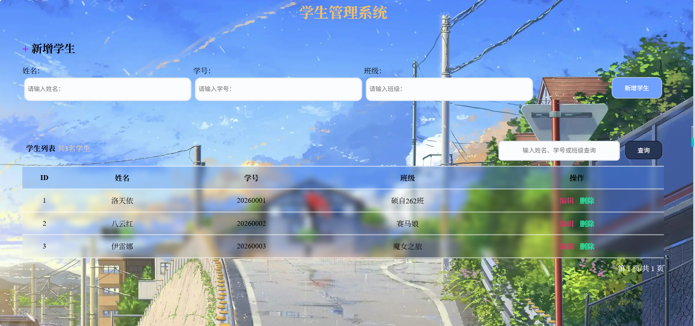
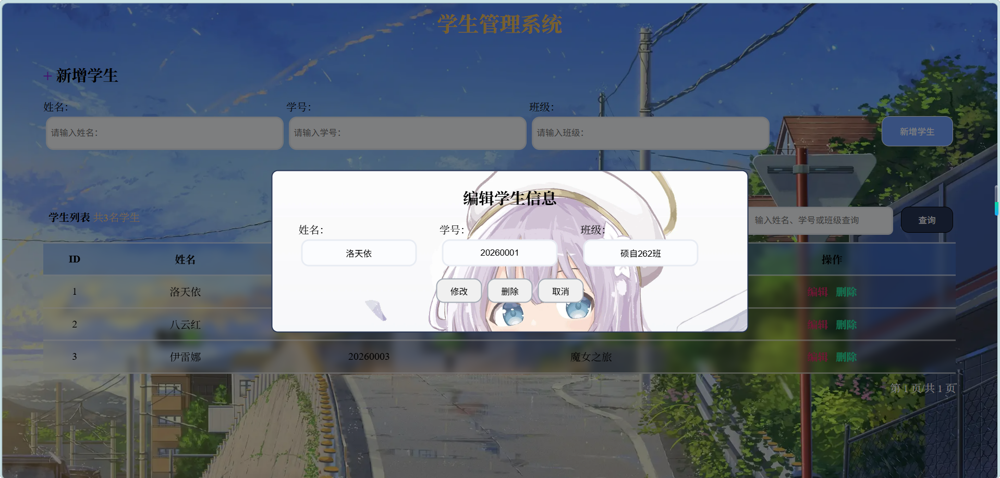
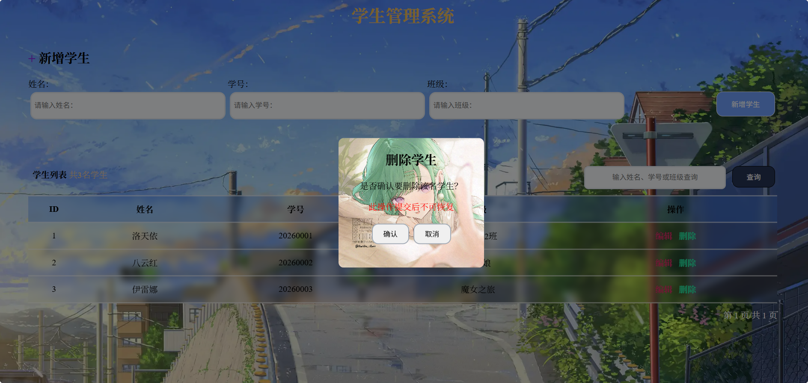

# 学生管理系统

## 功能：增删改查

【小彩蛋：点击标题（学生管理系统）可以全屏查看壁纸哦(●'◡'●)】

### 界面

### 修改学生

### 删除学生

## 参考资料

- [tabel布局中给tr加border边框_table tr 底部添加边框-CSDN博客](https://blog.csdn.net/CherryLee_1210/article/details/80622247)
- [使用 CSS 渐变 - CSS：层叠样式表 | MDN](https://developer.mozilla.org/zh-CN/docs/Web/CSS/Guides/Images/Using_gradients)
- [js如何判断一个字符串是否包含某个字符串 | PingCode智库](https://docs.pingcode.com/baike/2517945)
- [html - 详解如何给背景图片加颜色遮罩 - 个人文章 - SegmentFault 思否](https://segmentfault.com/a/1190000019291352)
- [html/css插入base64背景图片_css 给div设置背景图 base64-CSDN博客](https://blog.csdn.net/sman19999/article/details/121390363)
- [CSS半透明磨砂效果实现_css磨砂效果-CSDN博客](https://blog.csdn.net/weixin_45576923/article/details/123323651)
- [html如何让弹窗的位置居中 | PingCode智库](https://docs.pingcode.com/baike/3296002)
